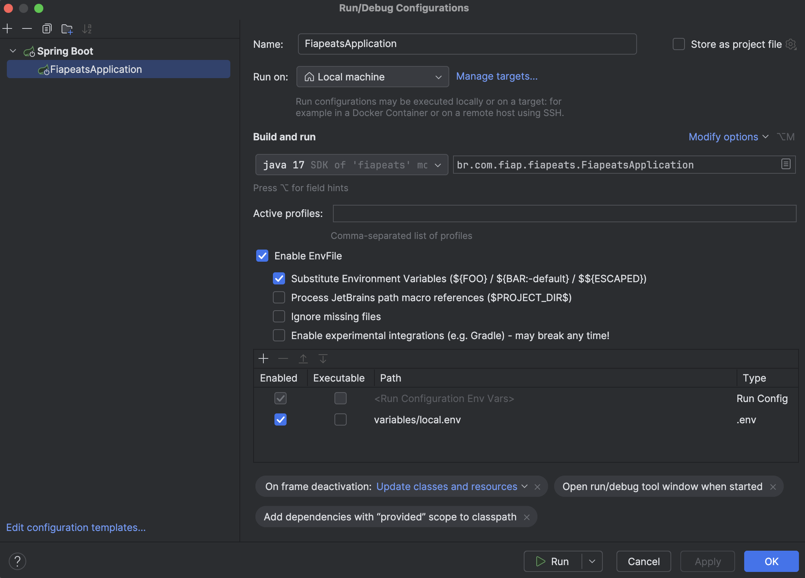

## FiapEats - Microserviço de Pedido

Este repositório contém o microserviço de pedido do FiapEats, uma aplicação que gerencia o fluxo de um pedido. Este serviço foi refatorado a partir de um monolito para operar de forma independente, seguindo boas práticas de arquitetura de microserviços.

### Estrutura Projeto

#### Diretórios usados
- /docs -> arquivos pertinentes a documentações
- /variables -> variaveis de ambiente usadas na app localmente, via kubernetes e via container
- /src -> código fonte da app
- /kubernetes -> configs de deployment,service,hpa e ingress da aplicação

#### Plugins
- Jacoco -> cobertura de testes unitários e análise
- Spotless -> identação de código padronizada

---
### Ambiente Docker


Foi criado o arquivo na raiz docker-compose.yaml que contempla a configuração necessários para compor o ambiente completo de nosso sistema.

Para executar o ambiente utilize o seguinte comando:
```bash
docker compose --profile app up -d
```

#### Configurando variáveis de ambiente

O projeto tem uma pasta chamada 'variables' e contém dois arquivos, eles representam as variaveis que a app usa em tempo de desenvolvimento 'local.env' e em tempo de execução no container 'ambient.env'.

No arquivo docker a referência já está criada e nada precisa ser feito, porém localmente iremos necessitar adicionar em nossa IDE um plugin para substituir automaticamente os valores do arquivo na nossa app.

- No menu superior, clique em File.
- Selecione Settings (ou Preferences no macOS).
- Navegar até Plugins:
- No painel de configurações, vá até a seção Plugins, que geralmente está localizada na coluna à esquerda.
- No painel de Plugins, clique na aba Marketplace para acessar a loja de plugins.
- Na barra de pesquisa, digite Enviar.file e pressione Enter.
- Encontre o plugin Enviar.file na lista de resultados.
- Clique no botão Install ao lado do nome do plugin para iniciar a instalação.
- Após a instalação, você será solicitado a reiniciar o IntelliJ IDEA. Clique em Restart IDE para aplicar as mudanças.


Após isso, na aba de configurações de execução da app só habiliar o uso do plugin e referenciar o arquivo 'local.env' dentro da pasta variables



---
### Evidência Coverage Sonar
